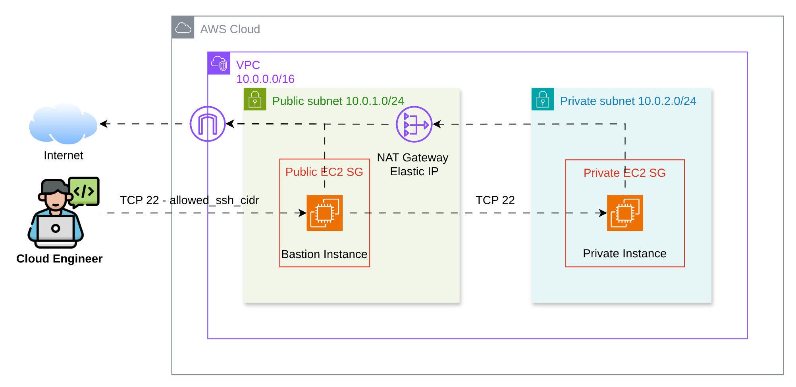

# NT548 Lab 01 — AWS Infrastructure with CloudFormation

## 1. Tổng quan

Lab này triển khai hạ tầng AWS bằng AWS CloudFormation: VPC, public/private subnet, Internet Gateway, NAT Gateway, route tables, Security Groups và hai EC2 gồm Bastion/Public EC2 cùng Private EC2.

Root template nằm tại [`cloudformation/templates/lab-01.yaml`](cloudformation/templates/lab-01.yaml). CloudFormation quản lý trạng thái stack trên AWS, nên không cần Terraform state, S3 backend hay DynamoDB lock.

<details>
<summary>Ấn để xem mục lục</summary>

- [1. Tổng quan](#1-tổng-quan)
- [2. Kiến trúc](#2-kiến-trúc)
- [3. Chuẩn bị](#3-chuẩn-bị)
- [4. Triển khai CloudFormation](#4-triển-khai-cloudformation)
- [5. Truy cập và kiểm thử](#5-truy-cập-và-kiểm-thử)
- [6. Cleanup](#6-cleanup)

</details>

## 2. Kiến trúc



| Thành phần | Cấu hình và vai trò |
| --- | --- |
| VPC | `10.0.0.0/16`, bật DNS support và DNS hostnames |
| Public Subnet | `10.0.1.0/24`, tự cấp public IPv4; chứa Bastion và NAT Gateway |
| Private Subnet | `10.0.2.0/24`, không tự cấp public IPv4; chứa Private EC2 |
| Internet Gateway | Route mặc định của Public Subnet ra Internet |
| NAT Gateway | Nằm ở Public Subnet, dùng Elastic IP để Private EC2 truy cập Internet outbound |
| Public Security Group | Chỉ mở TCP 22 từ `AllowedSshCidr` |
| Private Security Group | Chỉ mở TCP 22 từ Public Security Group |
| EC2 | Một Bastion có public IPv4 và một Private EC2 không có public IPv4 |

Private EC2 không nhận kết nối trực tiếp từ Internet. SSH đi qua Bastion; NAT chỉ phục vụ lưu lượng do Private EC2 khởi tạo. ICMP không được mở trong Security Group, vì vậy ping từ Bastion sang Private EC2 bị chặn đúng thiết kế.

Source được tách thành nested stacks tương tự các module của Terraform:

| Nested stack | Template | Vai trò |
| --- | --- | --- |
| `VpcStack` | [`modules/vpc.yaml`](cloudformation/templates/modules/vpc.yaml) | VPC và DNS |
| `NetworkingStack` | [`modules/networking.yaml`](cloudformation/templates/modules/networking.yaml) | Subnet, IGW, NAT Gateway, route table |
| `SecurityStack` | [`modules/security.yaml`](cloudformation/templates/modules/security.yaml) | Public/Private Security Group và SSH rules |
| `Ec2Stack` | [`modules/ec2.yaml`](cloudformation/templates/modules/ec2.yaml) | EC2 Key Pair, Bastion và Private EC2 |

Root stack truyền output của VPC cho networking/security, rồi truyền subnet và Security Group output cho EC2. `aws cloudformation package` upload các nested template lên S3 artifact bucket và thay đường dẫn cục bộ trước khi tạo stack.

## 3. Chuẩn bị

- AWS CLI v2 đã đăng nhập và có quyền tạo VPC, EC2, NAT Gateway, EIP, route table và Security Group.
- `jq`, OpenSSH client và SSH key cục bộ.
- AMI Amazon Linux 2023 hoặc Linux AMI phù hợp Region/instance type. Amazon Linux 2023 dùng SSH username `ec2-user`.
- Public IPv4 hiện tại ở dạng `/32` để giới hạn SSH vào Bastion.

Tạo SSH key tại thư mục gốc repository nếu chưa có:

```bash
mkdir -p key_pair
chmod 700 key_pair
ssh-keygen -t rsa -b 4096 -C "lab_key" -f key_pair/lab_key
chmod 400 key_pair/lab_key
```

Lấy AMI Amazon Linux 2023 x86_64 tại Singapore:

```bash
aws ssm get-parameter \
  --region ap-southeast-1 \
  --name /aws/service/ami-amazon-linux-latest/al2023-ami-kernel-default-x86_64 \
  --query 'Parameter.Value' \
  --output text
```

Lấy public IPv4 hiện tại:

```bash
curl -4 --fail --silent https://checkip.amazonaws.com
```

## 4. Triển khai CloudFormation

### 4.1. Cấu hình tham số

Tạo file tham số cục bộ từ file mẫu:

```bash
cp cloudformation/parameters/dev.json.example cloudformation/parameters/dev.json
```

Mở `cloudformation/parameters/dev.json` và thay ba placeholder:

| Parameter | Giá trị cần điền |
| --- | --- |
| `AllowedSshCidr` | Public IPv4 hiện tại kèm `/32` |
| `AmiId` | AMI Linux hợp lệ trong `ap-southeast-1` |
| `PublicKeyMaterial` | Toàn bộ một dòng trong `key_pair/lab_key.pub` |

`KeyName` mặc định là `lab_cfn_key` để không trùng Key Pair Terraform có thể còn trong AWS. CloudFormation tạo Key Pair này từ `PublicKeyMaterial`; private key vẫn là `key_pair/lab_key` ở máy cục bộ và bị Git ignore.

### 4.2. Package, validate và tạo stack

Nested stack cần được upload lên một S3 artifact bucket trước khi CloudFormation tạo root stack. Tạo bucket một lần; tên S3 phải duy nhất toàn cục:

```bash
ACCOUNT_ID=$(aws sts get-caller-identity --query Account --output text)
ARTIFACT_BUCKET="lab-01-cfn-artifacts-${ACCOUNT_ID}"

aws s3api create-bucket \
  --region ap-southeast-1 \
  --bucket "$ARTIFACT_BUCKET" \
  --create-bucket-configuration LocationConstraint=ap-southeast-1
```

Package root template và bốn nested template, sau đó validate file đã package:

```bash
aws cloudformation package \
  --region ap-southeast-1 \
  --template-file cloudformation/templates/lab-01.yaml \
  --s3-bucket "$ARTIFACT_BUCKET" \
  --output-template-file packaged.yaml

aws cloudformation validate-template \
  --region ap-southeast-1 \
  --template-body file://packaged.yaml

aws cloudformation create-stack \
  --region ap-southeast-1 \
  --stack-name lab-01-cfn-dev \
  --template-body file://packaged.yaml \
  --parameters file://cloudformation/parameters/dev.json

aws cloudformation wait stack-create-complete \
  --region ap-southeast-1 \
  --stack-name lab-01-cfn-dev
```

NAT Gateway thường cần vài phút để tạo. Khi lệnh `wait` hoàn tất, xem output:

```bash
aws cloudformation describe-stacks \
  --region ap-southeast-1 \
  --stack-name lab-01-cfn-dev \
  --query 'Stacks[0].Outputs' \
  --output table
```

## 5. Truy cập và kiểm thử

Lấy địa chỉ của hai EC2 từ stack output:

```bash
PUBLIC_IP=$(aws cloudformation describe-stacks \
  --region ap-southeast-1 \
  --stack-name lab-01-cfn-dev \
  --query "Stacks[0].Outputs[?OutputKey=='PublicInstancePublicIp'].OutputValue" \
  --output text)

PRIVATE_IP=$(aws cloudformation describe-stacks \
  --region ap-southeast-1 \
  --stack-name lab-01-cfn-dev \
  --query "Stacks[0].Outputs[?OutputKey=='PrivateInstancePrivateIp'].OutputValue" \
  --output text)
```

SSH vào Bastion:

```bash
ssh -i key_pair/lab_key ec2-user@"$PUBLIC_IP"
```

SSH vào Private EC2 qua Bastion. Nạp private key vào agent để jump host dùng key cục bộ:

```bash
eval "$(ssh-agent -s)"
ssh-add key_pair/lab_key

ssh -i key_pair/lab_key \
  -J "ec2-user@$PUBLIC_IP" \
  "ec2-user@$PRIVATE_IP"
```

Bộ test AWS CLI dùng chung tại [`testcases/`](testcases/). Tạo file cấu hình, bảo đảm `LAB_PROJECT_NAME = cloudformation-aws-lab`, rồi chạy:

```bash
cp testcases/.env.example testcases/.env
bash testcases/validate_aws_cli.sh
```

Kết quả đúng sẽ là `7 passed, 0 failed`. Từ Bastion có thể kiểm tra SSH port của Private EC2 bằng `nc -zv "$PRIVATE_IP" 22`. Ping bị chặn vì Private Security Group không cho inbound ICMP.

## 6. Cleanup

Xóa toàn bộ hạ tầng do CloudFormation quản lý:

```bash
aws cloudformation delete-stack \
  --region ap-southeast-1 \
  --stack-name lab-01-cfn-dev

aws cloudformation wait stack-delete-complete \
  --region ap-southeast-1 \
  --stack-name lab-01-cfn-dev
```

CloudFormation xóa VPC, EC2, NAT Gateway, Elastic IP, route tables, Security Groups và EC2 Key Pair. Hai file local trong `key_pair/` vẫn được giữ lại. NAT Gateway và Elastic IP có thể phát sinh chi phí, nên xóa stack khi hoàn tất lab.

Nếu không còn cần package lại stack, xóa artifact bucket và file package cục bộ:

```bash
aws s3 rb "s3://$ARTIFACT_BUCKET" --force
rm -f packaged.yaml
```
